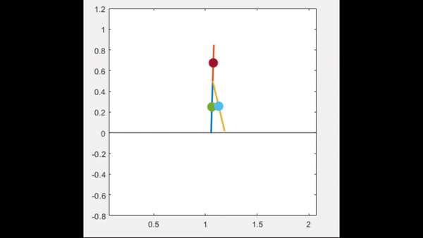
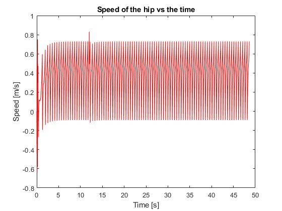
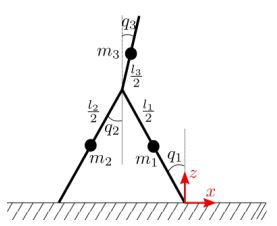

# Bipedal Robotic Walker

The bipedal walker simulation code contains various functions that simulate the dynamics of a simple 3-link bipedal walker. The walker is modelled as a rigid body with three segments: a torso and two legs. The simulation is performed using the Euler-Lagrange equations of motion, and the gait is generated using a hybrid zero dynamics-based + impedance controller.  
The simulation also includes a ground contact model and a collision handling method. 
[Run the code!](#running-the-code) 

The main features are:

- The main script, [`solve_eqns.m`](solve_eqns/solve_eqns.m), is used to simulate the dynamics of the bipedal walker. It takes as input the initial conditions of the system and the simulation parameters such as the duration of the simulation, the time step, and the number of steps to be taken. It returns the solution of the dynamics in the form of the state and control trajectories.

- The control function, [`control()`](control/control.m) implements the hybrid zero dynamics-based + impedance controller, which generates the desired torques for the two actuators (at the hip and inter-leg angles).  
_**NOTE** that in this case, the impedance controller happens to coincide with a PD controller (altered definition of error term)._

- The [`set_parameters()`](set_parameters/set_parameters.m) function is used to define the physical parameters of the robot, such as the masses and lengths of the links, and the acceleration due to gravity.

The remaining code is used to plot various metrics, such as the angles and velocities of the joints over time, the speed of the hip joint, the distance travelled by the bipedal walker in each step, the step frequency, and the torque applied to the actuators over time.   
It also calculates the cost of transport, which is a measure of the energy efficiency of the gait.
   
For example, below we see how the average speed of the hip evolves:

  
For the full example plots, see the images in [`images`](images/) folder.  

Overall, the code provides a basic implementation of a 3-link bipedal walker and a simple hybrid zero dynamics + impedance controller.  
The simulation results & metrics can be used to evaluate the performance of the controller and the efficiency of the gait.

 

---
 
The parameters of the model are defined in the following image:

**Note** that the hyper-parameters of the control system are contained entirely within the [`control()`](control/control.m) script, not shown here.  
Other notable scripts include:

- The [`kin_swf`](kinematics/kin_swf.m) function calculates the kinematics of the swing foot during the stance phase of the gait. It takes as input the current state of the system and returns the position and velocity of the swing foot.

- The [`eqns`](solve_eqns/eqns.m) function defines the equations of motion for the system, which are solved in [`solve_eqns.m`](solve_eqns/solve_eqns.m) (using the `ODE45`). It is used with an event function to detect collisions with the ground. The function returns the time vector T, the solution Y, the event time TE, and the solution at the event time YE.

# Running the code
To run the simulation, download the repo and run the [`run_me.m`](run_me.m) script. 
All folders must be in the same directory. 
The animation will automatically start, and last $\sim 20$ seconds, then all of associated the metrics & plots will appear (8 plots, main metrics in command window).
